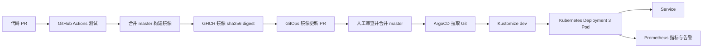

# CI/CD GitOps Kubernetes 学习项目
中文、可运行、业务 Deployment 固定 3 副本。项目只位于 C:\Users\AAA\Desktop\cicd-gitops。

## 实际完成状态
2026-10-09：复用 docker-desktop Kubernetes v1.36.1，Docker 29.6.1，Node v24.18.0，kubectl v1.36.1 / 内置 Kustomize v5.8.1，Git 2.55.0。
应用测试、配置检查、镜像构建、Kustomize 渲染、Kubernetes 服务端 dry-run 已完成。
本地 overlay 已部署到 cicd-demo，3 个业务 Pod Ready。它是本地运行验证，尚不是 GitOps CD。
ArgoCD v3.5.2 的 7 个组件均 Ready；Prometheus 已部署并抓取 3 个业务 Pod 和 Argo 指标，最终状态见 docs/validation.md。
已关联公开仓库 https://github.com/rafilo/cicd-playground ，默认分支 master；首次远程 CI 与 GHCR 推送已成功，发布 PR #1 检查通过，等待人工审查合并；最新状态见 docs/remote-validation.md。
dev 中 OWNER 与全零 digest 是明确占位符，必须先生成真实镜像 PR，再引导 Application。

## 架构

CI 没有 kubeconfig、集群凭据或部署命令；只有 ArgoCD 完成持续发布。手工 kubectl 仅用于首次引导、本地验证和运维。

## 工具与版本
需要 Docker Desktop Linux containers，Node.js 24，Git，PowerShell 7，kubectl 与服务端相差不超过一个 minor；kind 备用 v0.33.0。
kind 配置使用官方 v1.36.4 节点摘要，ArgoCD 固定 v3.5.2。Dockerfile 基础镜像的已验证摘要已固定。
Actions 使用 checkout/setup-node v4、Docker login/buildx v3、build-push v6、create-pull-request v7；学习项目使用主版本 tag，生产应按官方仓库审计并固定完整 commit SHA。
Argo 部署每个主要容器请求 25m/64Mi、限制 500m/512Mi，控制器请求 100m/128Mi、限制 1CPU/1Gi；初始化容器仍沿用官方清单。资源建议 Docker Desktop 分配至少 4 CPU / 6GB RAM；单节点不能提供节点级高可用。
业务共请求 150m CPU / 144Mi 内存，限制 750m / 384Mi；Prometheus 保留 24 小时、256MB，默认无需 Grafana。

## 运行与现有集群复用
先确认当前 context，避免误用生产：
```powershell
Set-Location C:\Users\AAA\Desktop\cicd-gitops
kubectl config current-context
kubectl get nodes
npm test
npm run validate
kubectl kustomize k8s/overlays/dev
.\scripts\cluster.ps1
```
cluster.ps1 健康集群直接复用；无集群时需要已安装 kind：
```powershell
New-Item -ItemType Directory -Force tools
Invoke-WebRequest https://kind.sigs.k8s.io/dl/v0.33.0/kind-windows-amd64 -OutFile tools/kind.exe
# 与官方 release 中校验和核对后，将 tools 目录加入当前 PATH
$env:Path = "$PWD\tools;$env:Path"
.\scripts\cluster.ps1
```
脚本不删除任何现有集群。新 kind 的 context 为 kind-cicd-gitops。

本地隔离验证（不作为 CD）：
```powershell
docker build -t cicd-demo:local-v2 --build-arg VERSION=local .
# 新 kind 集群需：kind load docker-image cicd-demo:local-v2 --name cicd-gitops
# 此机器 Docker Desktop 的镜像已可供现有节点使用
kubectl create namespace cicd-demo --dry-run=client -o yaml | kubectl apply -f -
kubectl apply --dry-run=server -k k8s/overlays/local
kubectl apply -k k8s/overlays/local
kubectl rollout status deploy/demo -n cicd-demo --timeout=180s
kubectl port-forward -n cicd-demo svc/demo 8080:80
# 另一终端：Invoke-RestMethod http://localhost:8080/
```

## GitHub / GHCR 配置与首次 GitOps 引导
1. 创建仓库（建议学习时公开），默认分支 master。将 argocd 两文件 repoURL/sourceRepos 的 OWNER 替换成精确仓库 URL；dev 镜像由首次 CI 更新。
2. 在此目录 git init -b master，git add .，git commit，然后按 GitHub 提示添加 origin 并 push。不要提交 Secret、kubeconfig、备份或 token。
3. 仓库 Settings → Actions 开启工作流。如需全自动创建 PR，创建仅授权此仓库的 fine-grained PAT，Contents: read/write、Pull requests: read/write，保存为 Actions secret **GITOPS_PR_TOKEN**。该 token 为可选；未配置时 CI 发布审查分支，维护者创建 PR。仅 PR 创建步骤使用它。也可改为 GitHub App 安装 token。GHCR 发布只使用临时 GITHUB_TOKEN 的 packages:write。
4. master 第一次 push 或手动 workflow_dispatch：测试 → 推送 ghcr.io/小写owner/小写repo:sha-提交SHA → 以构建返回的 sha256 digest 更新 dev → 创建分支 gitops/image-SHA 的 PR。合并前审查镜像路径、digest 与测试。配置 master 分支保护：必须 PR、至少一次人工审批、必须通过 test；不要允许自动合并绕过审批。
5. 推送只监听源码/测试/构建文件，镜像 PR 只改 dev 清单；合并不会再次构建，PR 检查全部执行，从而避免循环。PAT 可正常触发 PR 检查；无专用 PAT 时 CI 仍发布镜像并推送 gitops/image-SHA 审查分支，由维护者通过 GitHub CLI 创建 PR；没有直接部署或自动合并。
6. GHCR 包首次发布默认可能私有。公开镜像最省事：包 Settings 设置 public。私有镜像需要下面的集群 imagePullSecret；GITHUB_TOKEN 不适合长期集群拉取。
7. 合并首次真实 digest PR，确认 dev 不含 OWNER/全零值。然后执行：
```powershell
.\scripts\bootstrap.ps1 -RepoUrl https://github.com/rafilo/cicd-playground.git
kubectl port-forward -n argocd svc/argocd-server 8443:443
```
浏览器 https://localhost:8443，初始用户名 admin。仅在本机终端读取初始密码，登录后立即修改，勿贴到聊天或提交 Git：
```powershell
$s = kubectl get secret argocd-initial-admin-secret -n argocd -o json | ConvertFrom-Json
[Text.Encoding]::UTF8.GetString([Convert]::FromBase64String($s.data.password))
```
AppProject 只允许一个精确仓库、cicd-demo 命名空间与三种 namespaced 资源。Namespace 由管理员引导创建，不给应用创建集群级资源权限。Argo 安装本身需要管理员权限，其控制器权限比 AppProject 广，学习隔离不等于多租户安全边界。
私有 Git 仓库：通过 Argo UI Settings → Repositories 添加 HTTPS 只读 token；不要将凭据写入 Application。Argo 必须能访问 GitHub 和 GHCR。

私有 GHCR：创建 classic PAT read:packages（组织 SSO 时需授权），在 cicd-demo 创建 kubernetes.io/dockerconfigjson Secret，使用 kubectl create secret generic ghcr-pull --from-file=.dockerconfigjson=安全文件路径 --type=kubernetes.io/dockerconfigjson。安全文件从密码管理工具生成，不提交，创建后移除本地临时文件。在 dev Kustomize 添加 Deployment patch：
```yaml
patches:
  - target:
      kind: Deployment
      name: demo
    patch: |-
      - op: add
        path: /spec/template/spec/imagePullSecrets
        value: [{name: ghcr-pull}]
```
Secret 不放 Git、AppProject 不允许管理它；定期轮换 PAT 并验证新 Pod 可拉取。

## 验收与完整发布实验
```powershell
.\scripts\accept.ps1
kubectl get pods -n cicd-demo -l app=demo
kubectl get application cicd-demo -n argocd -o yaml
kubectl get deploy demo -n cicd-demo -o jsonpath='{.spec.template.spec.containers[0].image}'
```
完整实验：修改 app/server.js 消息 → 代码 PR 测试 → 合并 → 等 CI GHCR 推送和镜像 PR → 审批合并 → 等 Argo Synced/Healthy → accept.ps1 → HTTP 验证消息/version 为代码 SHA。记录两次 PR URL、Actions run URL、镜像 digest、Application status.sync.revision、Pod imageID 和 HTTP 响应。不要仅凭 Running 或工作流成功宣称链路通过。

## 运维
见 [运维手册](docs/operations.md) 与 [验证记录](docs/validation.md)。

## 官方依据（2026-10-09 已核对）
- [Kubernetes 探针](https://kubernetes.io/docs/tasks/configure-pod-container/configure-liveness-readiness-startup-probes/)
- [Kubernetes Disruptions / PDB](https://kubernetes.io/docs/concepts/workloads/pods/disruptions/)
- [kind v0.33.0 与节点摘要](https://github.com/kubernetes-sigs/kind/releases/tag/v0.33.0)
- [ArgoCD v3.5.2](https://github.com/argoproj/argo-cd/releases/tag/v3.5.2)
- [Argo 声明式配置](https://argo-cd.readthedocs.io/en/stable/operator-manual/declarative-setup/)
- [Argo 自动同步](https://argo-cd.readthedocs.io/en/stable/user-guide/auto_sync/)
- [GitHub 发布镜像](https://docs.github.com/en/actions/tutorials/publish-packages/publish-docker-images)
- [GHCR 权限](https://docs.github.com/en/packages/working-with-a-github-packages-registry/working-with-the-container-registry)
- [工作流触发与 token](https://docs.github.com/en/actions/how-tos/write-workflows/choose-when-workflows-run/trigger-a-workflow)
- [Prometheus 告警规则](https://prometheus.io/docs/prometheus/latest/configuration/alerting_rules/)

本地工作流静态检查：docker run --rm -v "C:/Users/AAA/Desktop/cicd-gitops:/repo:ro" -w /repo rhysd/actionlint:1.7.7 .github/workflows/ci.yaml
工作流固定下载 kubectl v1.36.1 并校验官方 SHA256，依据 https://kubernetes.io/docs/tasks/tools/install-kubectl-linux/ 。

本仓库使用 master 分支和 ghcr.io/rafilo/cicd-playground 镜像。未更改 Actions 创建/批准 PR 安全设置。未配置 GITOPS_PR_TOKEN 时，CI 推送审查分支后，运行 gh pr create --base master --head gitops/image-代码SHA 创建发布 PR。配置专用 token 后可自动创建 PR。不会将本机 CLI 登录凭据复制到 Actions。

最新远程进度：[CI 与发布 PR 验证记录](docs/remote-validation.md)。PR #1 合并前，集群继续运行 local-v2，尚未完成 GitOps CD。
