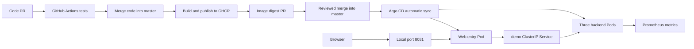

# Kubernetes GitOps CI/CD Playground

A runnable learning project with a dependency-free Node.js application, a web dashboard, three backend Pods, GitHub Actions, GHCR, Kustomize, and Argo CD.

- Repository: [rafilo/cicd-playground](https://github.com/rafilo/cicd-playground)
- Default branch: `master`
- Local checkout: `<your-directory>\cicd-gitops`
- Project cluster: `cicd-gitops`
- Kubernetes context: `kind-cicd-gitops`
- Application namespace: `cicd-demo`
- Homepage: [http://localhost:8081](http://localhost:8081), while port forwarding is running

## Architecture



CI builds images and updates Git through a reviewable PR. CI has no kubeconfig and never runs `kubectl apply` to deploy the application. Argo CD reconciles the GitOps manifests into Kubernetes.

The `demo` Deployment has three replicas. The additional `demo-web` Pod serves the homepage and forwards identity requests through the `demo` Service. Argo CD and monitoring Pods are separate from the three backend replicas.

Replace `<your-directory>` with the parent directory where you keep this checkout before running the commands.

## Requirements

| Tool | Project version or requirement |
| --- | --- |
| Docker Desktop | Running with Linux containers; tested with Docker Engine 29.6.1 |
| PowerShell | PowerShell 7 recommended |
| kind | v0.33.0 |
| Kubernetes | v1.36.4, pinned by node image digest in `cluster/kind.yaml` |
| kubectl | Tested with v1.36.1; keep within one minor version of the API server |
| Node.js | 24, needed for local development and tests |
| Git | Required to update the checkout |
| GitHub CLI | Optional; used to create and inspect PRs |
| Argo CD | v3.5.2, installed by the bootstrap script |
| Prometheus | v3.5.0, optional monitoring deployment |

Allocate approximately 4 CPUs and 6 GB RAM to Docker Desktop for this learning environment. The single-node cluster and single web entry are not a production high-availability design.

The application uses an official Node 24 Alpine base pinned by digest. No npm dependency installation or frontend build tool is required.

## Start an existing project cluster

Use this procedure after restarting your computer or Docker Desktop. Start Docker Desktop first and wait for the Docker Engine to become available.

### 1. Update the checkout and check Docker

```powershell
Set-Location "<your-directory>\cicd-gitops"
git switch master
git pull --ff-only origin master
docker info
docker ps -a --filter name=cicd-gitops-control-plane
```

If Git reports local changes, preserve or commit them before updating. Do not reset them blindly.

### 2. Start the existing node container if it is stopped

```powershell
docker start cicd-gitops-control-plane
kubectl config use-context kind-cicd-gitops
kubectl wait --for=condition=Ready nodes --all --timeout=180s
kubectl get nodes
```

If the container does not exist, follow **Create or rebuild the cluster** below.

If the container exists but the context is missing, restore its kubeconfig using the project-local kind executable:

```powershell
.\tools\kind.exe export kubeconfig --name cicd-gitops
kubectl config use-context kind-cicd-gitops
```

### 3. Wait for application recovery

Existing workloads normally recover automatically when the node starts.

```powershell
kubectl --context kind-cicd-gitops rollout status deployment/demo -n cicd-demo --timeout=300s
kubectl --context kind-cicd-gitops rollout status deployment/demo-web -n cicd-demo --timeout=300s
kubectl --context kind-cicd-gitops get application cicd-demo -n argocd
.\scripts\accept.ps1
```

Expected result: three backend Pods Ready, the web entry Ready, and the Argo CD Application `Synced` / `Healthy`.

If these resources are missing, run the bootstrap procedure below. A restart does not require rebuilding the application image.

### 4. Open the homepage

```powershell
kubectl --context kind-cicd-gitops port-forward -n cicd-demo svc/demo-web 8081:80
```

Open [http://localhost:8081](http://localhost:8081). Keep this terminal open; Ctrl+C stops only the port forward.

If port 8081 is occupied, use another local port, for example `18081:80`, and open `http://localhost:18081`.

## Create or rebuild the cluster

Use this procedure for a fresh installation or after the cluster has been deleted.

### 1. Prepare the project

If you already have the checkout, update it instead of cloning again:

```powershell
Set-Location "<your-directory>\cicd-gitops"
git pull --ff-only origin master
docker info
```

For a new checkout:

```powershell
Set-Location "<your-directory>"
git clone https://github.com/rafilo/cicd-playground.git cicd-gitops
Set-Location cicd-gitops
```

### 2. Install the pinned kind executable

These commands target Windows AMD64 and install kind inside the ignored `tools` directory:

```powershell
New-Item -ItemType Directory -Force tools | Out-Null
curl.exe -fLo tools/kind.exe https://kind.sigs.k8s.io/dl/v0.33.0/kind-windows-amd64
if ($LASTEXITCODE -ne 0) { throw 'kind download failed' }
.\tools\kind.exe version
```

See the [official kind installation instructions](https://kind.sigs.k8s.io/docs/user/quick-start/) and release checksums when verifying the downloaded binary.

### 3. Create the project cluster

```powershell
.\tools\kind.exe create cluster --name cicd-gitops --config cluster/kind.yaml --wait 180s
if ($LASTEXITCODE -ne 0) { throw 'Cluster creation failed' }
kubectl config use-context kind-cicd-gitops
kubectl wait --for=condition=Ready nodes --all --timeout=180s
```

The configuration pins the Kubernetes node image by digest. kind writes the connection information into kubeconfig.

The alternative helper `scripts/cluster.ps1` reuses any healthy cluster in the current context; it does not guarantee that the selected cluster is the project cluster. To use it, put `tools` on the current terminal's PATH and check the current context first.

### 4. Bootstrap Argo CD and the application

```powershell
.\scripts\bootstrap.ps1 -RepoUrl https://github.com/rafilo/cicd-playground.git
```

The script creates the application and Argo CD namespaces, installs Argo CD with learning-environment resource limits, and applies the AppProject and Application.

The AppProject permits only the configured repository, the `cicd-demo` namespace, and Deployment, Service, and PodDisruptionBudget resources. Namespace creation is an administrator bootstrap operation.

The dev overlay must contain a real published image digest. If bootstrap reports a placeholder digest, merge the image release PR and run `git pull --ff-only origin master` before retrying.

The repository and images must be reachable from the cluster. Current project images have been pulled successfully without an image pull secret.

### 5. Wait for GitOps deployment and verify

```powershell
kubectl wait --for=jsonpath='{.status.sync.status}'=Synced application/cicd-demo -n argocd --timeout=300s
kubectl wait --for=jsonpath='{.status.health.status}'=Healthy application/cicd-demo -n argocd --timeout=300s
kubectl rollout status deployment/demo -n cicd-demo --timeout=300s
kubectl rollout status deployment/demo-web -n cicd-demo --timeout=300s
.\scripts\accept.ps1
kubectl get pods -n cicd-demo -o wide
```

Then start the homepage port forward from the previous section.

### 6. Install optional monitoring

```powershell
kubectl create namespace cicd-observe --dry-run=client -o yaml | kubectl apply -f -
kubectl apply -f ops
kubectl rollout status deployment/demo-prometheus -n cicd-observe --timeout=180s
kubectl port-forward -n cicd-observe svc/demo-prometheus 9090:9090
```

Open [http://localhost:9090](http://localhost:9090) and check **Targets** and **Alerts**.

Prometheus discovers individual backend Pods through the headless metrics Service and scrapes Argo CD metrics. Rules cover unreachable backends, fewer than three reachable backend targets, and an unhealthy Argo CD Application. External notification delivery is not configured; alerts are visible in the UI.

Metrics retention is limited to 24 hours and 256 MB. Storage uses `emptyDir`, so history is disposable.

## Use and verify load balancing

On the homepage, click **Send 30 requests**. The dashboard displays:

- Request totals and success rate.
- The backend Pod serving each response.
- Per-Pod request counts and percentages.
- Average browser response time and recent requests.

The web entry opens a new upstream TCP connection for each identity request. The Kubernetes `demo` Service uses `sessionAffinity: None` and distributes connections to Ready backend endpoints. Distribution is not guaranteed to be equal, and a small sample might not reach every Pod.

Forward to **`svc/demo-web`**, not `svc/demo`, for this demonstration. `kubectl port-forward` to a Service selects an individual Pod; forwarding directly to a backend would bypass the Service's load-balancing path.

Dashboard counters belong to the current browser session. They are not a substitute for Kubernetes health checks.

## Argo CD access

Run this in another terminal:

```powershell
kubectl --context kind-cicd-gitops port-forward -n argocd svc/argocd-server 8443:443
```

Open [https://localhost:8443](https://localhost:8443). The initial local installation uses a self-signed certificate.

The initial username is `admin`. Read the initial password locally:

```powershell
$secret = kubectl get secret argocd-initial-admin-secret -n argocd -o json | ConvertFrom-Json
[Text.Encoding]::UTF8.GetString([Convert]::FromBase64String($secret.data.password))
```

Change the password after first login. Do not commit or share credentials. The initial Secret may be absent after it has been removed following setup.

## CI/CD release workflow

1. Create a code branch, update the application, and open a PR.
2. GitHub Actions runs application tests, configuration checks, and Kustomize rendering.
3. Merge the code PR into `master`.
4. CI builds and pushes `ghcr.io/rafilo/cicd-playground:sha-CODE_SHA`.
5. `docker/build-push-action` returns `steps.build.outputs.digest`.
6. `scripts/update-image.js` writes the immutable digest into the dev overlay.
7. Review and merge the image digest PR.
8. Argo CD pulls Git and rolls out the release automatically.

With the optional `GITOPS_PR_TOKEN` secret, CI creates the image PR automatically. Use a repository-scoped token with Contents and Pull requests read/write access, or adapt the workflow to a GitHub App installation token.

Without that secret, CI pushes the `gitops/image-CODE_SHA` review branch. A maintainer creates the PR:

```powershell
$sourceSha = 'REPLACE_WITH_FULL_CODE_COMMIT_SHA'
gh pr create --repo rafilo/cicd-playground --base master --head "gitops/image-$sourceSha" --title 'deploy: update application image' --body 'Review the immutable image digest before release.'
```

The built-in `GITHUB_TOKEN` publishes to GHCR. No local CLI credential needs to be copied into Actions.

Push-triggered image builds only run for application, test, Dockerfile, package, script, and workflow changes on `master`. GitOps-only and documentation-only merges do not start another image build. PR checks still run. Manual builds are available through **Actions -> CI and image PR -> Run workflow -> master**.

When a feature needs both a new image and new manifests, include its compatible manifests in the image release PR. During conflict resolution, preserve the intended new digest instead of restoring an older release.

For a fork, update both Argo CD repository URLs and the dev image name before bootstrap. The existing bootstrap replacement handles the original placeholder URL, not arbitrary fork URLs.

## Private repository and image authentication

For a private Git repository, add read-only repository credentials through Argo CD repository settings. Do not put credentials in Application manifests.

For a private GHCR image, create a `kubernetes.io/dockerconfigjson` Secret named `ghcr-pull` in `cicd-demo`, using a securely prepared Docker configuration file:

```powershell
kubectl create secret generic ghcr-pull -n cicd-demo --from-file=.dockerconfigjson=PATH_TO_SECURE_CONFIG --type=kubernetes.io/dockerconfigjson
```

Use a suitable package-read credential, authorize organization SSO if required, and add `imagePullSecrets: [{name: ghcr-pull}]` to **both** the backend and web Deployment Pod templates through the dev overlay. Do not commit the configuration file or Secret. Rotate credentials periodically.

## Local development

```powershell
npm test
npm run validate
node --check app/client.js
npm start
```

The standalone app listens on port 8080. Its local identity API reports one instance; cluster-wide load balancing requires the Kubernetes web-entry setup.

Useful endpoints:

| Path | Purpose |
| --- | --- |
| `/` | Frontend homepage |
| `/api/whoami` | Backend identity and application version |
| `/healthz` | Liveness probe |
| `/readyz` | Readiness probe |
| `/metrics` | Prometheus request counter |

Build a local image with `docker build -t cicd-demo:local-v2 --build-arg VERSION=local .`. The local overlay is for manual experiments in an isolated test cluster; do not apply it over the GitOps-managed deployment because Argo CD self-healing will restore the Git version.

## Operations and troubleshooting

```powershell
.\scripts\inspect.ps1
kubectl get pods -n cicd-demo -o wide
kubectl get events -n cicd-demo --field-selector type=Warning
kubectl logs -n cicd-demo -l app=demo --prefix --tail=100
kubectl logs -n cicd-demo -l app=demo-web --prefix --tail=100
kubectl get application cicd-demo -n argocd -o yaml
```

| Symptom | Check |
| --- | --- |
| Docker unavailable | Start Docker Desktop and wait for `docker info` to succeed |
| Project context missing | Export the existing kind cluster's kubeconfig |
| Node container missing | Recreate the cluster, then bootstrap |
| Placeholder digest error | Merge the image PR and update the local checkout |
| ImagePullBackOff | Digest existence, registry access, package visibility, and pull credentials |
| Argo CD comparison error | Repository URL, credentials, branch, and Kustomize path |
| Pending Pods | Docker resources, requests/limits, and scheduling events |
| Only one Pod observed | Forward through `demo-web`, then send another sample |
| Local port already occupied | Choose a different local port; backend Service ports need not change |
| Acceptance temporarily finds four Pods | Wait for rollout and old Pod termination, then retry |
| Homepage returns 502 | Check Ready backend endpoints, Service selector, DNS, and backend logs |
| `kubectl top` fails | It requires metrics-server, which this project does not install |

The backend uses readiness/liveness probes, resource requests/limits, non-root execution, a read-only filesystem, and dropped capabilities. Rolling updates allow one extra Pod with zero configured unavailable replicas. The PDB requires two available backends for voluntary eviction; it does not protect against direct deletion or a whole-node outage.

Rollback by reverting the release commit through a reviewed Git PR and allowing Argo CD to reconcile the previous digest. Keep old GHCR images available. A manual `kubectl rollout undo` is not a persistent GitOps rollback because self-healing restores Git state.

Git stores the application and infrastructure configuration. Keep repository backups and credential recovery information separately. The app has no persistent business data. Rebuilding this cluster and bootstrapping from Git restores the declared workloads, but not disposable Prometheus history. Any future database requires its own data backup and recovery plan.

Closing a port-forward terminal leaves the cluster running. Stopping Docker Desktop stops the local cluster. Do not delete the node container unless you intend to rebuild it.

## Resource layout

| Path | Purpose |
| --- | --- |
| `app/` | Dependency-free server, frontend assets, and web proxy |
| `test/` | Application, proxy, and digest-update tests |
| `Dockerfile` | Minimal Node Alpine application image |
| `cluster/kind.yaml` | Reproducible local Kubernetes node configuration |
| `k8s/base/` | Three backends, web entry, Services, and PDB |
| `k8s/overlays/dev/` | GitOps namespace and published image digest |
| `k8s/overlays/local/` | Local experiment image override |
| `argocd/` | Restricted project, application, and pinned installation |
| `ops/` | Optional lightweight Prometheus configuration |
| `scripts/` | Cluster setup, bootstrap, inspection, and validation |
| `.github/workflows/ci.yaml` | Tests, image publication, and release branch/PR |
| `docs/` | Additional notes and historical verification records; some remain in Chinese |
| `tools/` | Ignored local executables |
| `evidence/` | Optional ignored temporary verification output; safe to remove |

## Verification status

On 2026-10-10, the existing kind cluster was checked after recovery: the node was Ready, all three backend Pods and the web entry were Running/Ready, Argo CD was Synced/Healthy, and Prometheus was Running. A 30-request test through the web entry reached all three backend Pods.

Earlier validation also covered CI/GHCR publication, reviewed image releases, isolated three-backend traffic tests, desktop/mobile browser interaction, rolling updates, and single-Pod recovery. These are recorded observations, not a guarantee that a later local environment is already deployed or healthy.

## Official references

- [kind installation and cluster management](https://kind.sigs.k8s.io/docs/user/quick-start/)
- [kind v0.33.0 release and node image digests](https://github.com/kubernetes-sigs/kind/releases/tag/v0.33.0)
- [Kubernetes Services](https://kubernetes.io/docs/concepts/services-networking/service/)
- [Kubernetes port forwarding](https://kubernetes.io/docs/tasks/access-application-cluster/port-forward-access-application-cluster/)
- [Kubernetes probes](https://kubernetes.io/docs/tasks/configure-pod-container/configure-liveness-readiness-startup-probes/)
- [Kubernetes disruptions and PDBs](https://kubernetes.io/docs/concepts/workloads/pods/disruptions/)
- [Argo CD v3.5.2](https://github.com/argoproj/argo-cd/releases/tag/v3.5.2)
- [Argo CD declarative setup](https://argo-cd.readthedocs.io/en/stable/operator-manual/declarative-setup/)
- [Argo CD automated synchronization](https://argo-cd.readthedocs.io/en/stable/user-guide/auto_sync/)
- [GitHub Actions image publication](https://docs.github.com/en/actions/tutorials/publish-packages/publish-docker-images)
- [GitHub Container registry authentication](https://docs.github.com/en/packages/working-with-a-github-packages-registry/working-with-the-container-registry)
- [GitHub workflow triggering](https://docs.github.com/en/actions/how-tos/write-workflows/choose-when-workflows-run/trigger-a-workflow)
- [Official Node.js images](https://github.com/nodejs/docker-node)
- [Prometheus alerting rules](https://prometheus.io/docs/prometheus/latest/configuration/alerting_rules/)

## Local production deployment

See [the production migration runbook](docs/production.md) for the isolated multi-node environment, local ingress, promotion PRs, rollback, and remaining production requirements.

`powershell
./scripts/start-production.ps1
` 

Application: http://localhost:18080
